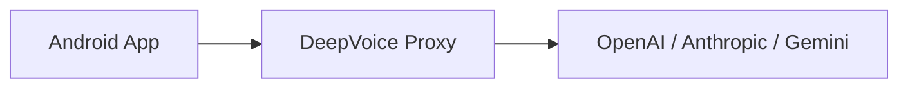

# DeepVoiceChat 🎙️

**Talk to any LLM on Android with real-time, non-rushed voice mode.**

DeepVoiceChat is a voice-first AI interface designed for natural conversations. Unlike standard voice assistants that cut you off mid-sentence, DeepVoiceChat uses a "Push-to-Talk" flow combined with Whisper's precision and smart TTS chunking to ensure a smooth, professional experience.

---

## ✨ Features

- 🎤 **Whisper STT**: High-precision voice-to-text powered by OpenAI's Whisper model.
- 🔊 **Smart TTS**: Sentence-aware chunking handles even the longest AI brain-dumps without silence.
- 🎨 **Beautiful UI**: Native **Markdown rendering** (bold, italics, code blocks) and emerald green status indicators.
- 🤖 **Multi-Model Support**: Switch instantly between **GPT-4o, Claude 3.5**, and **Gemini 2.0**.
- 🔍 **Search Integration**: Toggle real-time search for up-to-date information.
- 🔒 **Privacy First**: Proxy-based architecture keeps your API keys off the device.

## 🚀 Quick Start

### 1. Deploy the Proxy
DeepVoiceChat requires a lightweight bridge to securely handle API calls.
→ [Deploy DeepVoice Proxy in 1-click](https://github.com/ulapopov/deepvoice-proxy)

### 2. Configure the Android App
1. Clone this repository.
2. Open in Android Studio.
3. Update `baseUrl` in `MainViewModel.kt` with your deployed proxy URL.
4. Build and Run!

## 📸 Screenshots & Demo

| Chat Interface | Voice Mode |
| :---: | :---: |
|  |  |

---

## 🛠️ Architecture

## 🏷️ GitHub Topics
`android`, `llm`, `voice`, `chatbot`, `whisper`, `openai`, `gemini`, `claude`, `kotlin`, `jetpack-compose`

## 📄 License
MIT
