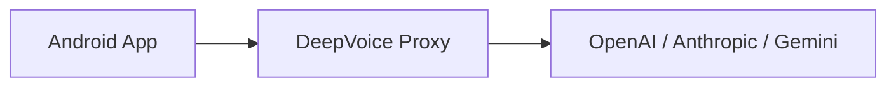

# DeepVoiceChat 🎙️

**Talk to real reasoning models on Android — by voice.**

DeepVoiceChat is a push-to-talk Android app for voice conversations with OpenAI, Anthropic, and Gemini models. It uses Whisper (STT) + text LLMs + TTS so you get thoughtful answers, not rushed “instant voice” replies.

**Bonus:** You can interrupt playback anytime.

**Why:** Most voice modes are optimized for speed, not depth — DeepVoiceChat lets you pick the model and prioritize the quality you want.

---

## ✨ Features

- 🌍 **Multi-Provider**: OpenAI, Anthropic (Claude), Gemini.
- 🤖 **Exact Model Selection**: Choose the exact model (e.g., GPT-5, Claude, Gemini Pro).
- 🎤 **Whisper STT**: Whisper speech-to-text for input.
- 🔊 **Smart TTS**: Text-to-speech playback for responses (with smart chunking).
- 🛑 **Push-to-Talk**: Interruptible playback (stop anytime).
- 🎨 **Beautiful UI**: Native **Markdown rendering** (bold, italics, code blocks) and emerald green status indicators.
- 🔍 **Search Integration**: Toggle real-time search for up-to-date information.
- 🔒 **Privacy First**: Proxy-based architecture keeps your API keys off the device.

## 🚀 Quick Start

### 1. Deploy the Proxy
DeepVoiceChat requires a lightweight bridge to securely handle API calls.
→ [Deploy DeepVoice Proxy in 1-click](https://github.com/ulapopov/deepvoice-proxy)

### 2. Configure the Android App
1. Clone this repository.
2. Open in Android Studio.
3. Update `baseUrl` in `MainViewModel.kt` with your deployed proxy URL.
4. Build and Run!

## 📸 Screenshot

  

---

## 🛠️ Architecture

## 🏷️ GitHub Topics
`android`, `llm`, `voice`, `chatbot`, `whisper`, `openai`, `gemini`, `claude`, `kotlin`, `jetpack-compose`

## 📄 License
MIT
