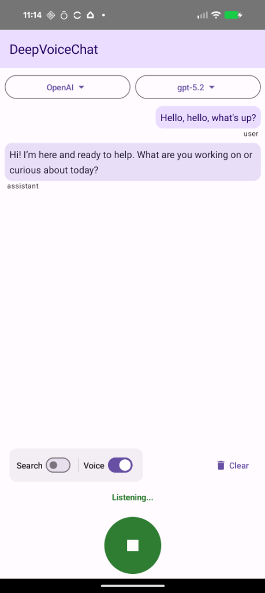
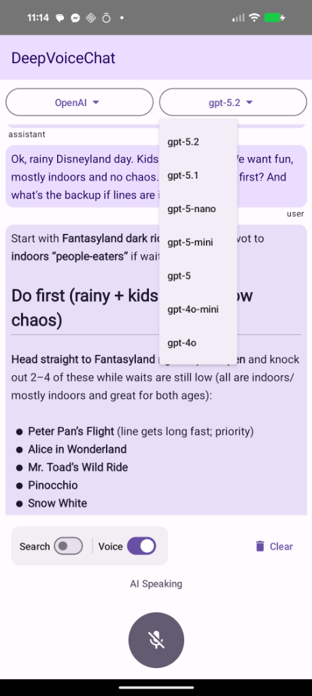
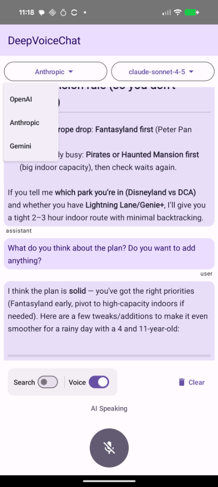

# DeepVoiceChat 🎙️
**Talk to real reasoning models on Android — by voice.**

DeepVoiceChat is a push-to-talk Android app for voice conversations with **OpenAI**, **Anthropic (Claude)**, and **Gemini** models. It uses **Whisper (STT)** + **text LLMs** + **TTS** so you get deeper answers, not rushed “instant voice” replies.

**Bonus:** you can interrupt playback anytime.

**Why:** Most voice modes are optimized for speed, not depth — DeepVoiceChat lets you pick the model and prioritize the quality you want.

> **Note:** DeepVoiceChat currently requires a lightweight **proxy** (Vercel or self-hosted). Users still **bring their own API keys**.

## ✨ Features
- 🌍 **Multi-Provider:** OpenAI, Anthropic (Claude), Gemini
- 🤖 **Exact Model Selection:** choose the exact model (e.g., GPT-5, Claude, Gemini Pro)
- 🔁 **Mid-conversation switching:** switch providers/models anytime (GPT ↔ Claude ↔ Gemini) and keep the same conversation context
- 🎤 **Whisper STT:** speech-to-text input
- 🔊 **Smart TTS:** chunked playback for smoother listening
- 🛑 **Push-to-Talk:** interrupt playback anytime
- 🔒 **BYOK:** use your own API keys (configured in the proxy)
- 🧩 **Proxy required:** Vercel-deployable or self-hosted

> **Note:** DeepVoiceChat keeps a single session history. If you switch provider/model mid-chat, the newly selected model sees the full prior conversation (including responses from other providers).

## 🚀 Quick Start

### 1) Deploy the Proxy (required)
- **Option A — Vercel (recommended):** [Deploy DeepVoice Proxy in 1 click](https://github.com/ulapopov/deepvoice-proxy)
- **Option B — Self-host:** run the proxy locally on your computer/server

### 2) Point the Android app to your proxy
Set `baseUrl` in `MainViewModel.kt` to:
- **Vercel:** `https://<your-deployment>.vercel.app`
- **Local dev (same Wi-Fi):** `http://<your-computer-local-ip>:<port>`

### 3) Add your API keys
Configure provider keys in the proxy environment variables (OpenAI / Anthropic / Gemini).

## 📸 Screenshots

  
  
  

---

## 🛠️ Architecture
Voice → Whisper (STT) → Proxy → LLM (text) → Proxy → TTS → Audio

## 🏷️ GitHub Topics
`android`, `llm`, `voice`, `whisper`, `openai`, `gemini`, `anthropic`, `claude`, `reasoning`, `kotlin`
